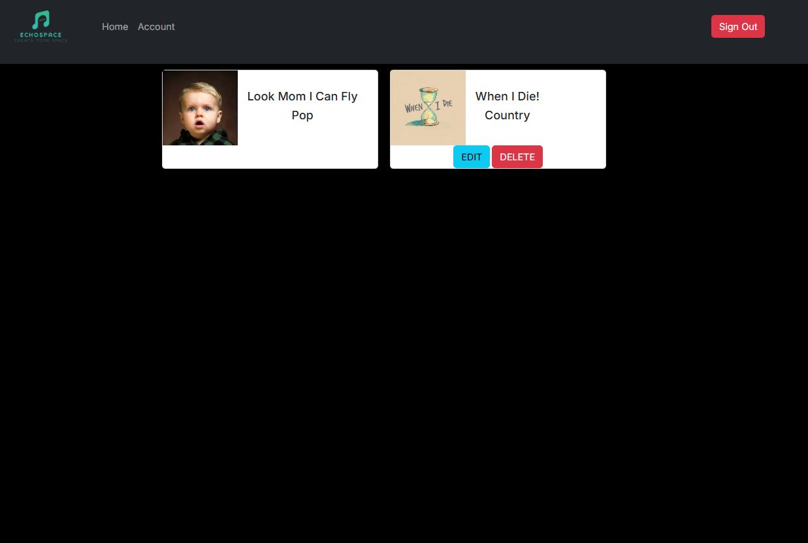
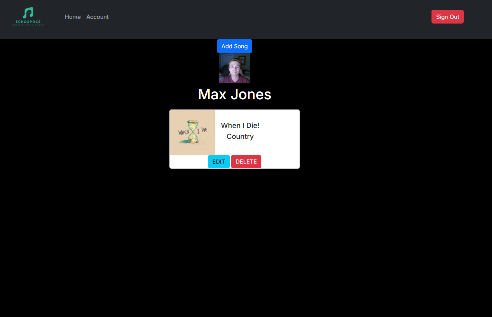
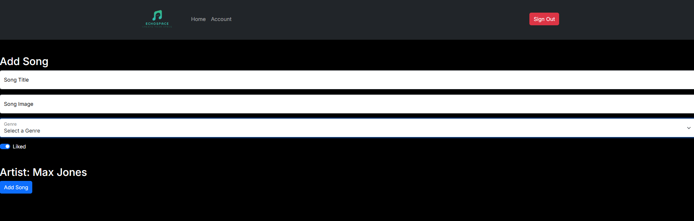

Welcome To EchoSpace!

This project is here to create a customizable music app the user can really feel that is their own. Here the user will be able to move around the sections on their home page, specify the music they want to see inside of each section, and hopefully even be able to select the template style of each section.

Deployed Site- https://echospacee.netlify.app/

Repo- https://github.com/MaxJones129/EchoSpace

WireFrame- https://miro.com/app/board/uXjVLG_rKxo=/?share_link_id=816607320618

Project Board- https://github.com/users/MaxJones129/projects/4/views/1

Target User- Any Human On The Earth That Listens To, or Makes, Music Through an App.

Currently the app has these features:
 - Add Your Songs
 - Delete Your Songs
 - Edit Your Songs
 - View All User Songs
 - Ability to Choose Song's Genre, and Visually See It.

Loom Video- https://www.loom.com/share/42ff7cc279f24aaea290fa9782520a6f?sid=46f2998f-be9c-46b2-82ad-df86a748b8a4

Home Page

Account Page

Create/Edit Page

